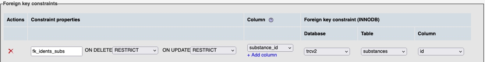
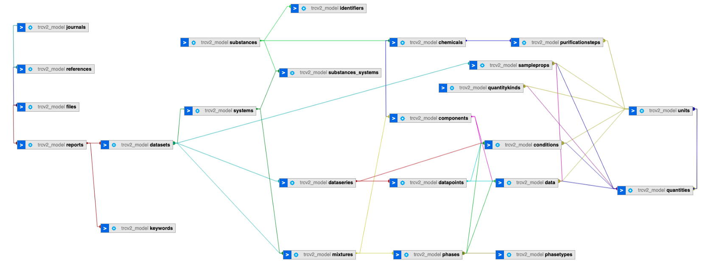

This repository provides a MySQL database populated with data from ThermoML (XML) files documented at 
https://trc.nist.gov/ThermoML/ and available at https://doi.org/10.18434/mds2-2422. The available files can be 
downloaded from the links below (there is no need to clone the whole repository):
- [trcv2_cws.sql.zip](mysql/trcv2_cws.sql.zip): full database plus crosswalk tables (29 tables)
- [trcv2.sql.zip](mysql/trcv2.sql.zip): full database (26 tables)
- [trcv2_model.sql](mysql/trcv2_model.sql): empty database, data model only (26 tables)

### Rationale
As part of an [NSF project](https://www.nsf.gov/awardsearch/showAward?AWD_ID=1835643) the set 
of ThermoML files created by the NIST Thermodynamics Research Center (TRC) in Boulder, CO, USA 
was ingested into a MySQL database as a stepping stone to subsequent conversion of the data 
into JSON-LD files in the [SciData framework](https://stuchalk.github.io/scidata/) format. This 
dataset is made available as an example of translating an XML data model into a relational 
database model, in this case implemented according to the SciData framework.  It is 
also used to exemplify the following tenets of good data management: data modeling, unique 
identifiers (foreign keys in database tables) and best practices for findable, interoperable, 
accessible, and reusable ([FAIR](https://www.go-fair.org/)) data.

### About ThermoML
ThermoML is an [International Union of Pure and Applied Chemistry (IUPAC) standard](https://iupac.org/what-we-do/digital-standards/thermoml/),
(list of references included) for thermophysical property data.  The schema file for ThermoML 
is available at https://trc.nist.gov/ThermoML.xsd and parts of the schema and how they relate
to the MySQL data model can be seen on the pages for the different database tables [here](mysql_tables).

### Important Features of the Database
* The acronym "[DRY](https://en.wikipedia.org/wiki/Don%27t_repeat_yourself)", standing for
  "don't repeat yourself", is used as a mechanism to create the data model. That is, where 
  data or metadata can be abstracted into definitive,  unique entities (e.g., 
  chemical substances) it is done once (in one table), given a unique id, a "primary key", 
  and referenced in other tables by using the primary key in a "foreign key" field.

* [Foreign key constraints](https://dev.mysql.com/doc/refman/5.7/en/create-table-foreign-keys.html) 
  in relational databases are a way to ensure a higher level of integrity in the stored data. 
  As an example, in a table a set of unique entries for chemical `substances` is created.
  In another table, `identifiers` for those substances are captured, and in each record of an 
  identifier a foreign key field points to the substance that identifier identifies. Now, if 
  at some point a `substances` table entry is found to be a duplicate of another, it will be deleted 
  from the `substances` table. However, any entries in the `identifiers` table pointing to that
  substance will remain, and point to a substance that no longer exists. This data is now 
  considered to be 'orphaned data', i.e., data that is not part of the data model. Creating a 
  foreign key constraint in the `identifiers` table (see image from phpMyAdmin below)
  by linking the 'substance_id' field in the `identifiers` table to the 'id' field of the 
  `substances` table, means that when we try to delete a row in the `substances` table with at
  least one entry in the `identifiers` table, it will not be permitted.  This ensures there 
  are no 'orphaned' entries in the `identifiers` table.

### SciData Data Model

The SciData data model for the TRC data is based off of the ThermoML schema and adds the 
idea that data in each dataset can be generally be thought of as a (data)series of (data)points.
where each datapoint connects experimental conditions to an experimental datum. In the SciData
framework there is also the concept that a dataset is a set of data about a specific 
system under study (in this case a pure substance or mixture of substances, akin to the 
`PureOrMixtureData` element in ThermoML) published in a research paper (`Citation` section in ThermoML). 
Finally, in SciData there is also a section for methodology, about how the research was done,
but for this dataset no information has been included.

### List of Database Tables
- [chemicals](mysql_tables/table_chemicals.md): chemicals used in an experiment
- [chemicals_datasets](mysql_tables/table_chemicals_datasets.md): a join table between the chemicals and datasets tables
- [components](mysql_tables/table_components.md): components of a mixture studied in the research
- [conditions](mysql_tables/table_conditions.md): experimental conditions of an experiment (including fixed conditions)
- [data](mysql_tables/table_data.md): raw experimental data with quantities, values, uncertainties and units
- [datapoints](mysql_tables/table_datapoints.md): abstract concept linking data conditions and data
- [dataseries](mysql_tables/table_dataseries.md): abstract concept datapoints together (not spectral data)
- [datasets](mysql_tables/table_datasets.md): abstract concept representing a set of data about a substance from a reference
- [files](mysql_tables/table_files.md): capturing the metadata about the data files that hold the original data
- [identifiers](mysql_tables/table_identifiers.md): identifiers of chemical substances
- [journals](mysql_tables/table_journals.md): metadata about the journals in which the references are published
- [keywords](mysql_tables/table_keywords.md): keywords describing important features of the data captured
- [mixtures](mysql_tables/table_mixtures.md): representation of physical mixtures of chemicals
- [phases](mysql_tables/table_phases.md): phases of matter of experimental solutions
- [phasetypes](mysql_tables/table_phasetypes.md): representation of the different phase types
- [purificationsteps](mysql_tables/table_purificationsteps.md): metadata about the steps by which chemicals have been purified
- [quantities](mysql_tables/table_quantities.md): table of the quantities measured in the data
- [quantitykinds](mysql_tables/table_quantitykinds.md): table of the quantitykinds that the quantities are instances of
- [references](mysql_tables/table_references.md): metadata about the papers from which the data is reported
- [reports](mysql_tables/table_reports.md): an abstract representation of the content of the data from a paper
- [sampleprops](mysql_tables/table_sampleprops.md): information about the characteristics of chemicals (samples)
- [substances](mysql_tables/table_substances.md): metadata about chemical substances
- [substances_systems](mysql_tables/table_substances_systems.md): a join table between the substances and systems tables 
- [systems](mysql_tables/table_systems.md): representation of abstract mixtures of substances
- [units](mysql_tables/table_units.md): metadata about the units of measurements used to represent the data

### Conversion and Validation
The conversion of this dataset was accomplished using a CakePHP application available at 
[SciData_TRC](https://github.com/ChalkLab/SciData_TRC). Validation of the data, by comparing the XML data
to that in the database, was accomplished by additional PHP scripts in the same repository. See the repository
for more information.

Internal validation of numeric data for conditions and experimental data was
achieved by storing the original data from the XML file in a string field, and as separate significand, exponent and
accuracy (significant digits) fields.  This avoids issues with the potential loss of trailing zeroes that can be a
problem in code. See the [`conditions`](mysql_tables/table_conditions) and [`data`](mysql_tables/table_data) tables for details.

### Augmentation with Additional Metadata
To enable interoperability of this data additional metadata has been added to certain tables.  These are:
- datasets table: a unique identifies was created from the `<TRCRefID/>` element data and the index of the 
dataset in the XML file
- identifiers table: chemical identifiers where added using scripts that requested data from the following sites
  - [https://commonchemistry.org](https://commonchemistry.org): CAS Registry Number
  - [https://pubchem.ncbi.nlm.nih.gov](https://commonchemistry.org): IUPAC name, PubChem CID
- journals table: all metadata was added by hand
- quantitykinds: definitions and definition sources were added
- substances table: molecular weights where added from [PubChem](https://pubchem.ncbi.nlm.nih.gov/) and
classifications (type and subtype) were added from [Classyfire](http://classyfire.wishartlab.com/)
- units table: encodings of units of measurement from the [QUDT](https://www.qudt.org/) vocabulary/ontology

### User Access
The database contains one user account.  Username: admin, Password: password)

### Disclaimer
This work was completed independently of the creators of the NIST ThermoML dataset.  It was also done
independently of the International Union of Pure and Applied Chemistry ([IUPAC](https://iupac.org/)) 
and therefore does not have any endorsement from IUPAC, even though the developer is an active member 
of the IUPAC and is currently a member of the IUPAC Committee on Publications and Cheminformatics 
Data Standards ([CPCDS](https://iupac.org/body/024/)).