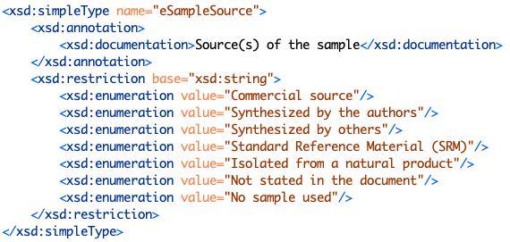

# Table: chemicals

Description: Table of metadata about chemical samples reported in the ThermoML file `<Sample>` section, i.e.:

## Fields
* **id**: chemical primary key
* **file_id**: foreign key ([files table](table_files.md)) of the file this chemical is part of
* **orgnum**: the assigned user organization number, from the paper
* **substance_id**: foreign key ([substances table](table_substances.md)) of the compound this chemical is a sample of
* **sourcetype**: where the sample came from - see options below
* **updated**: datetime last updated

## Comments
Purity information for chemical samples is stored in the [purifcationsteps table](table_purifcationsteps.md) as the 
purification process can contain 1 to n purification steps.  Each step references a chemical in this table.