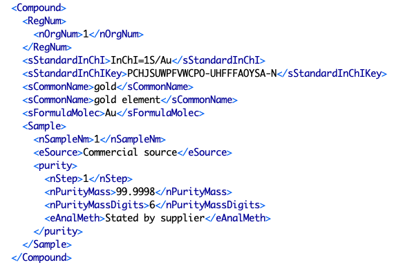
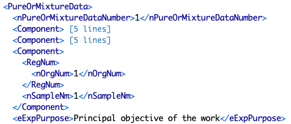

# Table: chemicals_datasets

Description: A join table of to link chemicals (samples of a chemical substance) and datasets via the `Component` element.  This is a convenience
table to make it easier to access in scripts (datasets -> scidata).

## Fields
* **id**: chemicals_datasets primary key (auto-generated and unique)
* **chemical_id**: foreign key ([chemicals table](table_chemicals.md)) linking to a chemical that is part of a dataset
* **dataset_id**: foreign key ([datasets table](table_datasets.md)) linking a dataset to a chemical it uses
* **updated**: datetime last updated