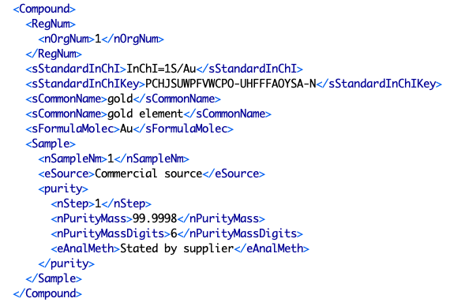

# Table: components

Description: Join table of chemicals in mixtures (a mixture is defined as the chemical 
components defined in a `PureOrMixtureData` element). An additional field indicates the index
of a (chemical) component as listed in a `PureOrMixtureData` element.

## Fields
* **id**: components primary key (auto-generated and unique)
* **chemical_id**: foreign key ([files table](table_files.md)) of a chemical that is part of the mixture
* **mixture_id**: foreign key ([substances table](table_substances.md)) of the mixture this chemical is part of
* **compnum**: the component number (index of the `component` element in the `PureOrMixtureData` element) of the chemical
* **updated**: datetime last updated
