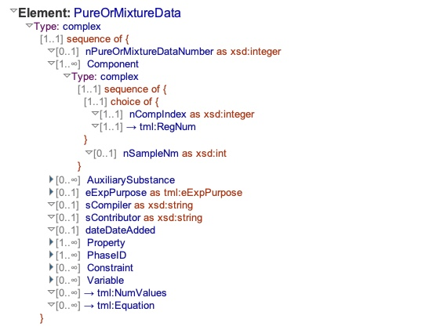
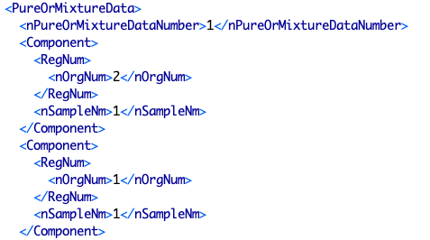
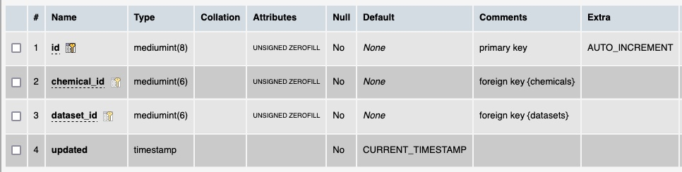

# Table: chemicals_datasets

**Description**: A join table of to link chemicals (samples of a chemical substance) and datasets via the `Component` element.

### 'Component' section in the ThermoML Schema

### Example data of a 'Component' in the 'PureOrMixtureData' section of a ThermoML file

### MySQL 'chemicals_datasets' table structure

### MySQL Fields
* **id**: chemicals_datasets primary key (auto-generated and unique)
* **chemical_id**: foreign key ([chemicals table](table_chemicals.md)) linking to a chemical that is part of a dataset
* **dataset_id**: foreign key ([datasets table](table_datasets.md)) linking a dataset to a chemical it uses
* **updated**: datetime last updated

### Comments
This table is a convenience table and not absolutely necessary. Formally, the link between chemicals and datasets is:
- `datasets` are linked to `systems`
- `systems` are joined to `substances` through `substances_systems`
- `substances` are linked by `chemicals`