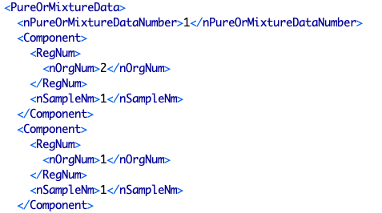

# Table: components

**Description**: Metadata about components in mixtures (a mixture is defined by the chemical components defined 
in a `PureOrMixtureData` element). An additional field indicates the index of a (chemical) component as listed 
in a `PureOrMixtureData` element.

### 'Component' sections in the ThermoML Schema

### Example data of a 'Component' in the 'PureOrMixtureData' section of a ThermoML file

### MySQL 'components' table structure

### MySQL Fields
* **id**: components primary key (auto-generated and unique)
* **chemical_id**: foreign key ([chemicals table](table_chemicals.md)) of a chemical that is part of the mixture
* **mixture_id**: foreign key ([mixtures table](table_mixtures.md)) of the mixture this chemical is part of
* **compnum**: the component number (index of the `component` element in the `PureOrMixtureData` element) of the chemical
* **updated**: datetime last updated

### Comments
The `compnum` index is not specified in the ThermoML file.  Instead, it is inferred as the position of each `Component`
section in the XML file via code.