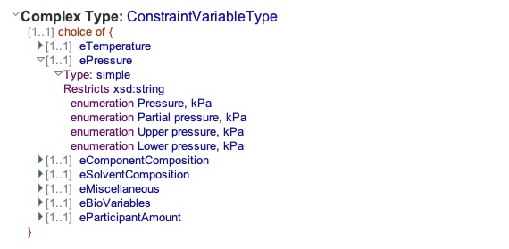
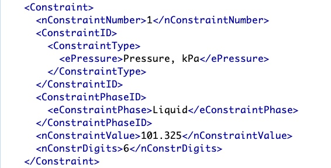
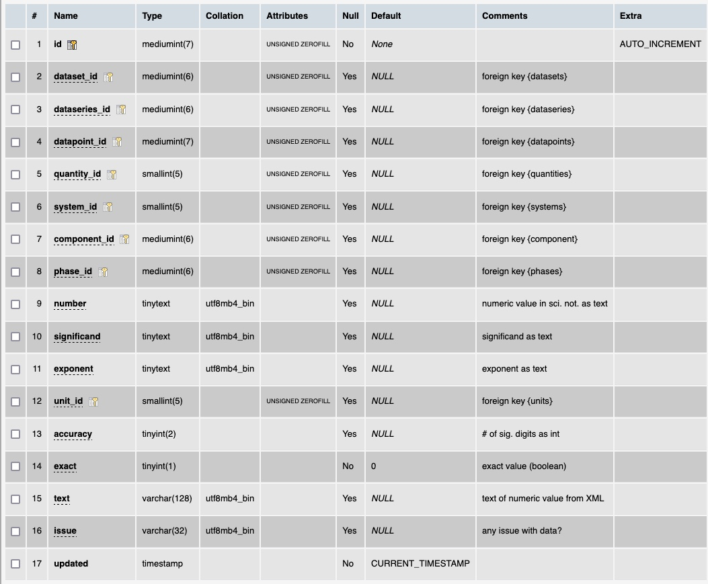

# Table: conditions

**Description**: Conditions are numeric values of quantities that characterise the conditions under which
and experiment was done.  In this context, there are two different types of conditions:
- series conditions: conditions that are invariant across a `dataseries`, in ThermoML these are `Constraints`
- (datum) conditions: conditions that vary across a `dataseries`, in ThermoML these are call `Variables`

### 'Constraint' section in the ThermoML Schema

### Example data of a '?' in the '?' section of a ThermoML file

### MySQL '?' table structure

### MySQL Fields
* **id**: components primary key (auto-generated and unique)
* **dataset_id**: foreign key ([datasets table](table_datasets.md)) of the dataset the `dataseries` is part of
* **dataseries_id**: foreign key ([dataseries table](table_dataseries.md)) of the `dataseries` the condition belongs to
* **datapoint_id**: foreign key ([datapoints table](table_datapoints.md)) of the `datapoint` the condition belongs to
* **quantity_id**: foreign key ([quantities table](table_quantities.md)) of the `quantity` measured
* **system_id**: foreign key ([systems table](table_systems.md)) of the chemical `system` under study
* **component_id**: foreign key ([components table](table_components.md)) of the `component` in the `mixture` analyzed
* **phase_id**: foreign key ([phases table](table_phases.md)) of the `phase` investigated
* **number**: numeric value in scientific format in the format '<sig>e<exp>' using +/- for the exponent (as text)
* **significand**:  value of the significand of the datum value when converted to scientific notation (as text)
* **exponent**: magnitude of the exponent of the value when converted to scientific notation (as text)
* **unit_id**: foreign key ([units table](table_units.md)) of the `unit` of the value
* **accuracy**: the number of significant digits in the value
* **exact**: boolean field that indicates if the datum is an exact value or not
* **text**: the value of the condition in the ThermoML file (as text)
* **issue**: temporary field to record if there is an issue with a datapoint during validation
* **updated**: datetime last updated

### Comments
The dataset_id field was added as a convenience to allow statistics generation. Formally, the link between datasets 
and conditions is:
- `conditions` are linked to `datapoints` or `dataseries`
- `datapoints` are linked to `dataseries`
- `dataseries` are linked by `datasets`