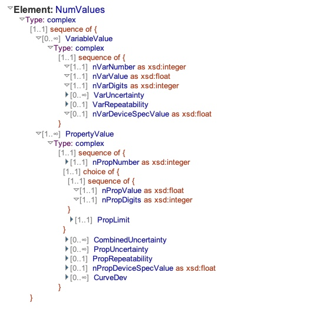
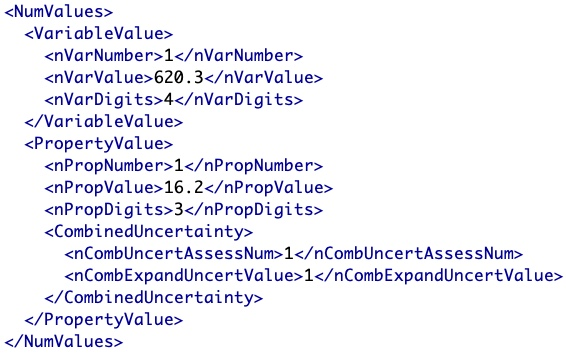
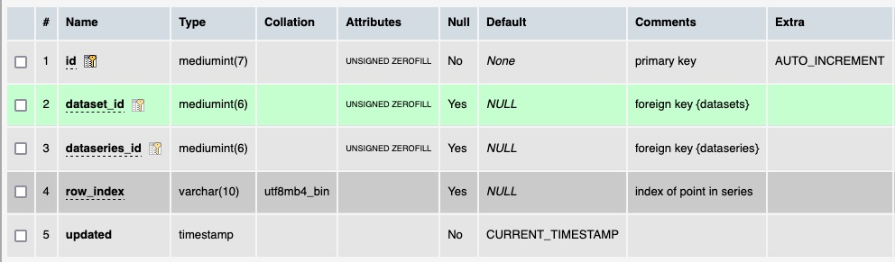

# Table: datapoints

**Description**: Datapoints are an abstract concept that connect series conditions, conditions and datums together. 
Think of them as equivalent to a row in a data table.

### 'NumValues' section in the ThermoML Schema

### Example data of a 'NumValues' in the 'PureOrMixtureData' section of a ThermoML file

### MySQL 'datapoints' table structure

### MySQL Fields
* **id**: datapoints primary key (auto-generated and unique)
* **dataset_id**: foreign key ([datasets table](table_datasets.md)) of the dataset the `dataseries` is part of
* **dataseries_id**: foreign key ([dataseries table](table_dataseries.md)) of the `dataseries` the condition belongs to
* **row_index**: the index of a datapoint in a dataseries
* **updated**: datetime last updated

### Comments
The dataset_id field was added as a convenience to allow statistics generation. Formally, the link between datasets
and datapoints is:
- `datapoints` are linked to `dataseries`
- `dataseries` are linked to `datasets`