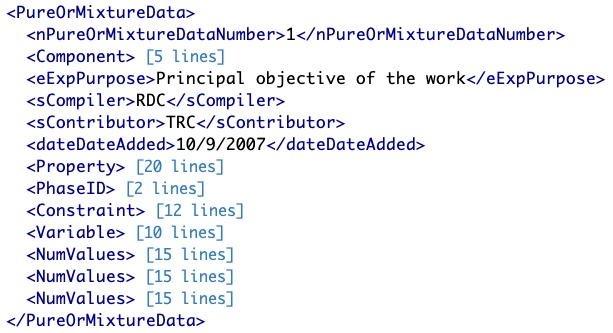
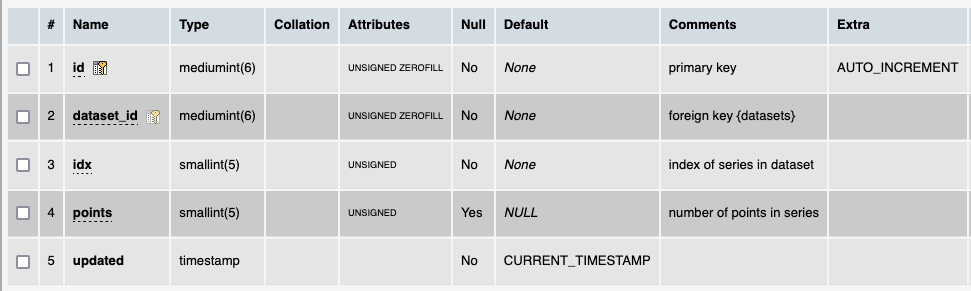

# Table: dataseries

**Description**: A dataseries is a set of datapoints that a recorded over at least one invariant condition, and thus 
logically grouped.  In a ThermoML file this is the content on one `PureOrMixtureData` section.

### 'PureOrMixtureData' section in the ThermoML Schema

### Example data of a 'PureOrMixtureData' section of a ThermoML file

### MySQL 'dataseries' table structure

### MySQL Fields
* **id**: dataseries primary key (auto-generated and unique)
* **dataset_id**: foreign key ([datasets table](table_datasets.md)) of the dataset the `dataseries` is part of
* **idx**: the index of the datapoint in the dataseries (based on appearance in the ThermoML file)
* **points**: number of datapoints in a dataseries
* **updated**: datetime last updated
