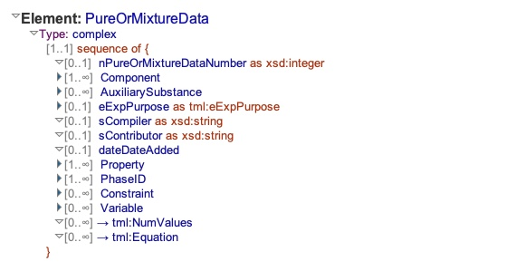
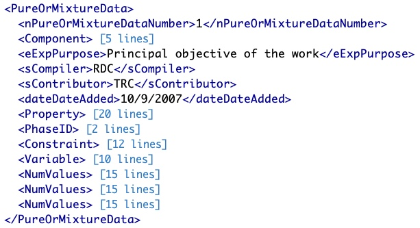

# Table: datasets

**Description**: Datasets can be thought of in many ways.  In terms of being able to apply the concept across multiple
data sources and as a consequence limit the size of a dataset the following definition of dataset in this set is:
> "A dataset is defined as all the data published in a research paper that is about the same chemical system."

This means that a ThermoML file that contains many `PureOrMixtureData` sections may contain one dataset, if all the 
sections are data for the same chemical system, or multiple datasets if the chemical systems are different.

### 'PureOrMixtureData' sections in the ThermoML Schema

### Example data of a 'PureOrMixtureData' in a ThermoML file

### MySQL 'datasets' table structure

### MySQL Fields
* **id**: datasets primary key (auto-generated and unique)
* **title**: autogenerated title based on the setnum and the DOI of the reference
* **setnum**: index of the dataset in the ThermoML file inferred by script
* **file_id**: foreign key ([files table](table_files.md)) of the `file` the dataset is part of
* **report_id**: foreign key ([reports table](table_reports.md)) of the `report` the dataset is part of
* **system_id**: foreign key ([systems table](table_systems.md)) of the chemical `system` under study
* **reference_id**: foreign key ([references table](table_references.md)) of the `reference` the dataset belongs to
* **trcrefset_id**: unique id created by using the data in the ThermoML `<TRCRefID>` section concatenated with setnum
* **points**: number of datapoints in a dataset
* **updated**: datetime last updated

### Comments
In this data model the datasets section is the central linking point connecting the data model together.