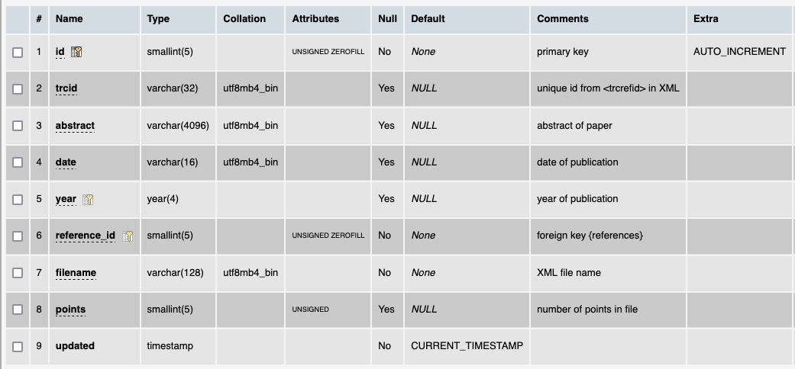

# Table: files

**Description**: Metadata describing the ingested ThermoML files.

### MySQL 'files' table structure

### MySQL Fields
* **id**: files primary key (auto-generated and unique)
* **trcid**: unique id created by using the data in the ThermoML `<TRCRefID>` section
* **abstract**: abstract of the paper reported in the `<sAbstract>` field in the ThermoML file
* **date**: the citation date of the paper reported in the `<dateCit>` field in the ThermoML file
* **year**: the publication year of the paper reported in the `<yrPubYr>` field in the ThermoML file
* **reference_id**: foreign key ([references table](table_references.md)) of the `reference` the dataset belongs to
* **filename**: the name of the ThermoML file
* **points**: number of datapoints in a file
* **updated**: datetime last updated
