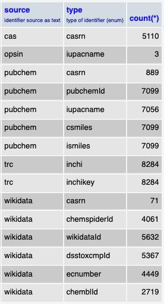
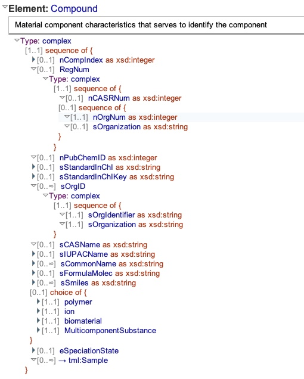
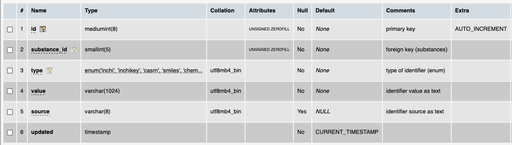

# Table: identifiers

**Description**: Table of identifiers of chemical substances. These can be formal specifications or primary keys 
of online databases.  Some in this table where derived from the ThermoML files and others were retrieved from other 
sites using the InChIKey as the search term. Examples are:
- ThermoML file: InChI and InChIKey
- [PubChem](https://pubchem.ncbi.nlm.nih.gov/): PubChem Compound ID (CID), IUPAC name, CAS Registry Number, canonical
smiles string and isomeric smiles string
- [CommonChemistry](https://commonchemistry.cas.org/): CAS Registry Number
- [Wikidata](https://www.wikidata.org/): Wikidata ID, ChemSpiderID, CAS Registry Number, DSSTox Compound ID, 
EC Number and CheMBL ID
- [OPSIN](https://opsin.ch.cam.ac.uk/): IUPAC Name

Statistics on the sources of identifiers in database (for 8284 unique chemical substances) are below.

### Fields from the 'Compound' section in the ThermoML Schema

### Example data from a 'Compound' section of a ThermoML file

### MySQL 'identifiers' table structure

### MySQL Fields
* **id**: components primary key (auto-generated and unique)
* **substance_id**: foreign key ([substances table](table_substances.md)) of a substance that an identifier represents
* **type**: enumerated list of types of identifier stored in the table
* **value**: text value of an identifier
* **source**: the source (ThermoML file or online database) of the identifier
* **updated**: datetime last updated
