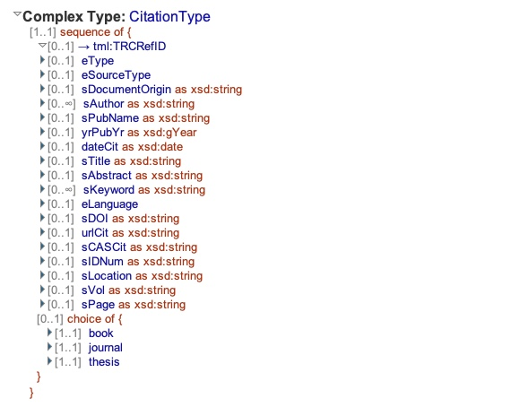
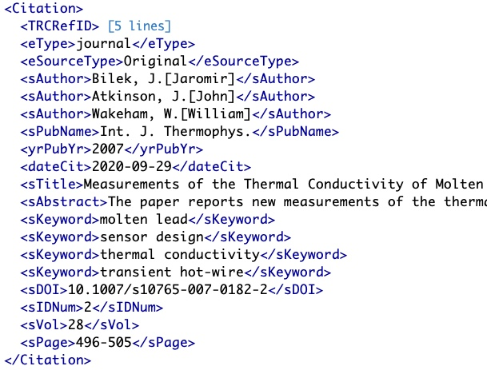

# Table: journals

Description: Table of metadata about the journals the references in this dataset are published in.

### 'sPubName' field in the ThermoML Schema

### Example data of the 'sPubName' in the 'Citation' section of a ThermoML file

### MySQL 'references' table structure

### MySQL Fields
* **id**: components primary key (auto-generated and unique)
* **name**: the journal name
* **coden**: six-character code for a [serial](https://en.wikipedia.org/wiki/CODEN) (journal) 
* **issn**: the [International Standard Serial Number (ISSN)](https://en.wikipedia.org/wiki/International_Standard_Serial_Number) for a serial (journal)
* **set**: a short text code for the journal 
* **language**: the journals language
* **abbrev**: abbreviation of the journal name according to the [List of Title Work Abbreviations](https://www.issn.org/services/online-services/access-to-the-ltwa/) 
from ISSN International Centre
* **publisher**: the journal publisher
* **homepage**: the homepage of the journal
* **doiprefix**: the unique starting prefixes of the DOIs created for papers published in this journal
* **updated**: datetime last updated
