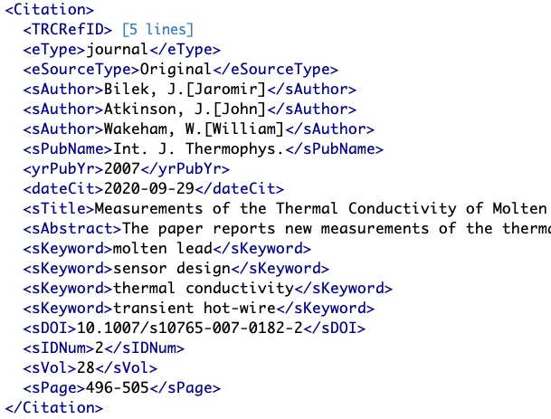
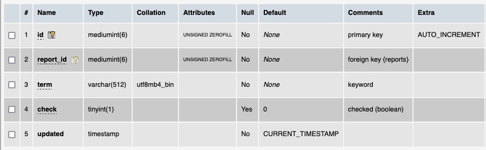

# Table: keywords

**Description**: Keywords are often used to characterise the topic(s) of a publication.  This table aggregates all the
keywords across the set of ThermoML files.

### 'sKeyword' field in the ThermoML Schema

### Example data of the 'sKeyword' field in the 'Citation' section of a ThermoML file

### MySQL '?' table structure

### MySQL Fields
* **id**: files primary key (auto-generated and unique)
* **report_id**: foreign key ([reports table](table_reports.md)) of the `report` a keyword is part of
* **term**: the keyword
* **check**: temporary field containing a 'Yes' if a script identified there might be an issue with the value
* **updated**: datetime last updated

### Comments
In some ThermoML files the sKeyword fields had keywords that were incorrect.  These have been removed from the table.