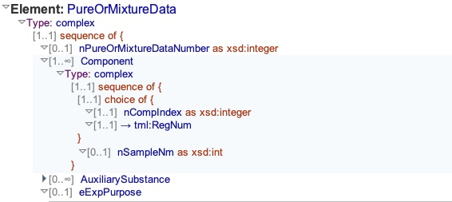

# Table: mixtures

**Description**: A join table between the systems and datasets tables.  This allows the combination
of one or more components to be represented as a (real) instance of an (abstract) system.

### 'Component' section in the ThermoML Schema

### Example data of set a 'Components' in a 'PurOrMixtureData' section of a ThermoML file

### MySQL 'mixtures' table structure

### MySQL Fields
* **id**: mixtures primary key (auto-generated and unique)
* **system_id**: foreign key ([systems table](table_systems.md)) of the chemical `system` under study
* **dataset_id**: foreign key ([datasets table](table_datasets.md)) of the dataset `mixture` is part of
* **updated**: datetime last updated