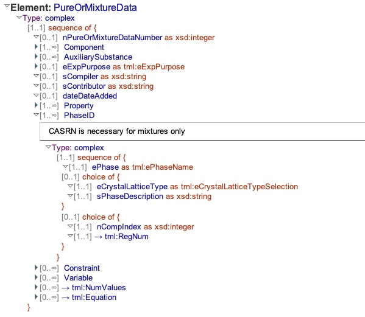
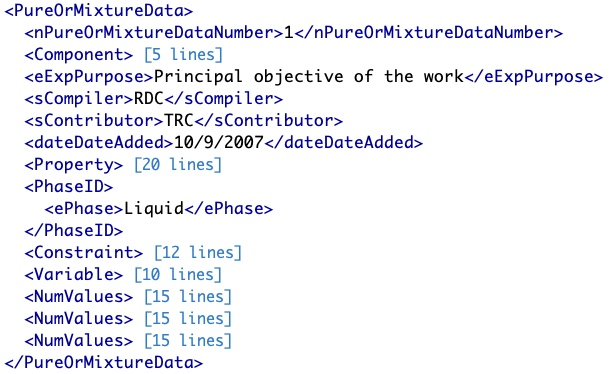
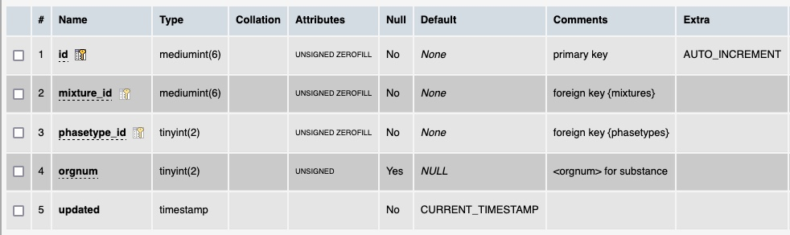

# Table: phases

**Description**: Representation of the phase of material that was studied in the research.

### 'PhaseID' section in the ThermoML Schema

### Example data of an 'ePhase' field in the 'PureOrMixtureData' section of a ThermoML file

### MySQL '?' table structure

### MySQL Fields
* **id**: phase primary key (auto-generated and unique)
* **mixture_id**: foreign key ([mixtures table](table_mixtures.md)) of the chemical `system` under study
* **phasetype_id**: foreign key ([phasetypes table](table_phasetypes.md)) of the dataset `mixture` is part of
* **updated**: datetime last updated

### Comments
The phasetypes were abstracted into a separate table to include the general phasetype as well as the specific
one reported in the ThermoML file.