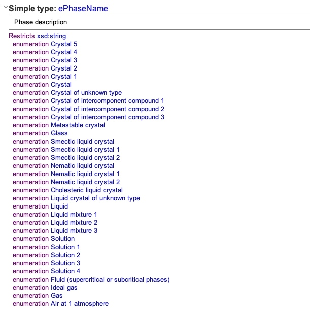
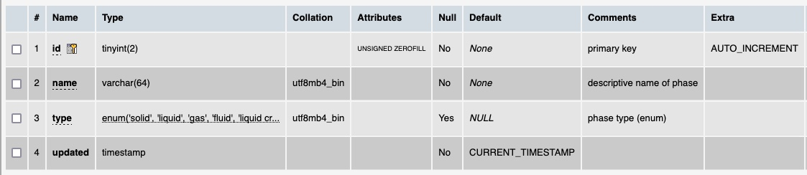

# Table: phasetypes

**Description**: Table of the different phase types defined in the ThermoML schema.

### 'ePhaseName' field in the ThermoML Schema

### Example data of a '?' in the '?' section of a ThermoML file

### MySQL 'phasetypes' table structure

### MySQL Fields
* **id**: phase primary key (auto-generated and unique)
* **name**: name of the phase under study from the ThermoML PhaseID field
* **type**: general phase types (enumerated list)
* **updated**: datetime last updated

### Comments
The phasetypes were abstracted into a separate table to include the general phasetype as well as the specific
one reported in the ThermoML file.