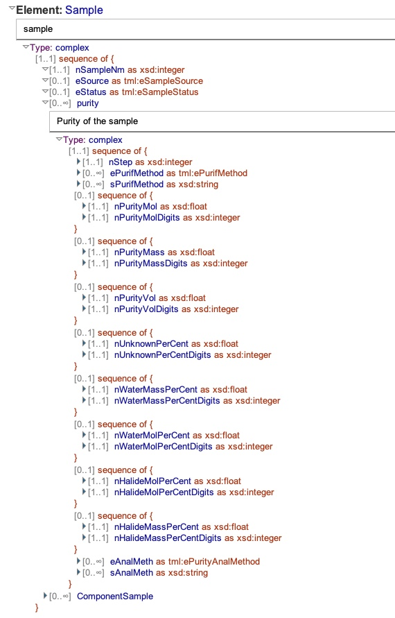
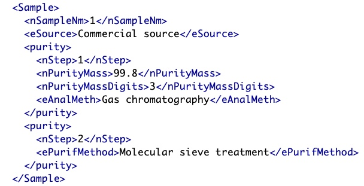
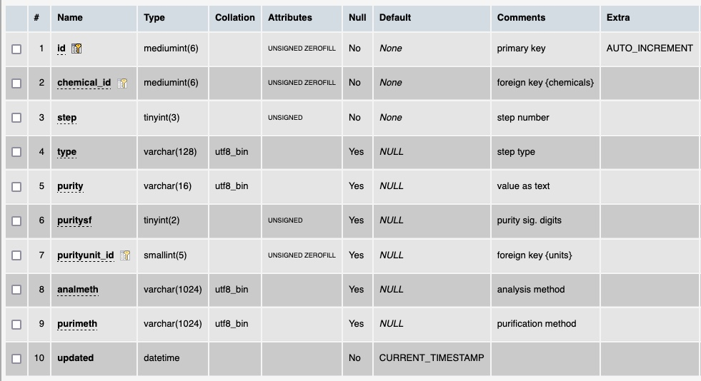

# Table: purificationsteps

**Description**: This table captures the purification steps that were used (if any) to y the 

### 'purity' section in the ThermoML Schema

### Example data of a 'purity' in the 'Sample section of a ThermoML file

### MySQL 'purificationsteps' table structure

### MySQL Fields
* **id**: phase primary key (auto-generated and unique)
* **chemical_id**: foreign key ([chemicals table](table_chemicals.md)) linking to a chemical that the phase applies to
* **step**: the index of the purification step in the overall purification process
* **type**: the type of chemical purified
* **purity**: the value of the purity as text
* **puritysf**: the number of significant digits of the purity value
* **purityunit_id**: foreign key ([units table](table_units.md)) of the purity value `unit`
* **analmeth**: description of the analysis method
* **purimeth**: description of the purification method
* **updated**: datetime last updated
