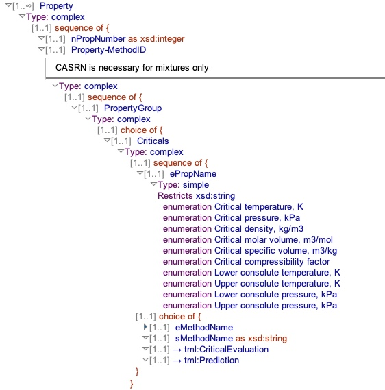
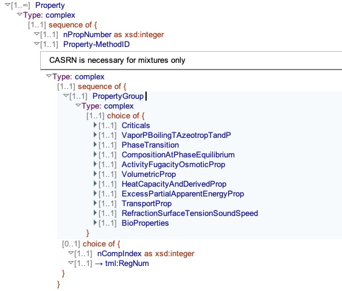
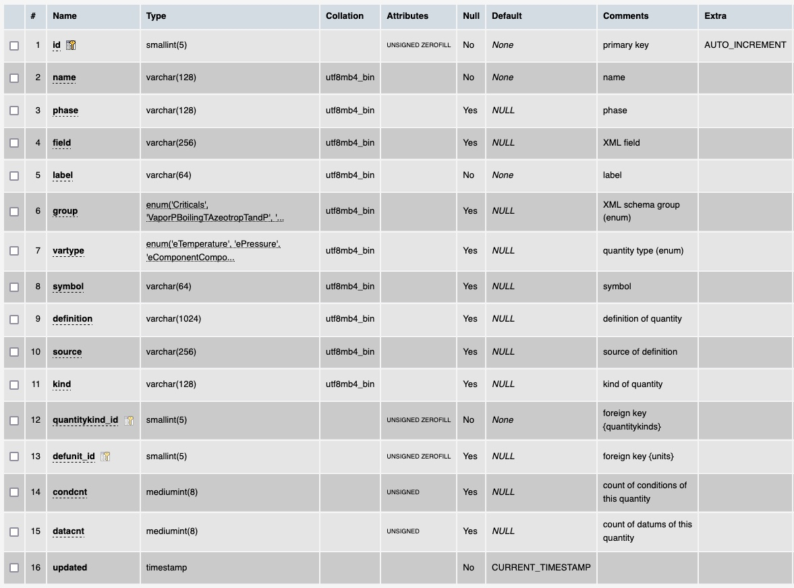

# Table: quantities

**Description**: Table of quantities in the ThermoML schema.

### 'Property' section in the ThermoML Schema

### 'PropertyGroup' section in the ThermoML Schema

### MySQL 'quantities' table structure

### MySQL Fields
* **id**: quantity primary key (auto-generated and unique)
* **name**: the quantity name
* **phase**: the phase of matter the quantity can be measured in
* **field**: the ThermoML file representation of the quantity
* **label**: generic label for display
* **group**: the ThermoML schema group that the quantity is part of (see above)
* **vartype**: the ThermoML type of the quantity that it is classified in
* **symbol**: the quantity symbol
* **definition**: definition of the quantity
* **source**: the source of the definition of the quantity
* **kind**: temporary field to record the quantitykind before assigning the quantitykind_id
* **chemical_id**: foreign key ([chemicals table](table_chemicals.md)) of a chemical that is part of the mixture
* **mixture_id**: foreign key ([mixtures table](table_mixtures.md)) of the mixture this chemical is part of
* **compnum**: the component number (index of the `component` element in the `PureOrMixtureData` element) of the chemical
* **updated**: datetime last updated
