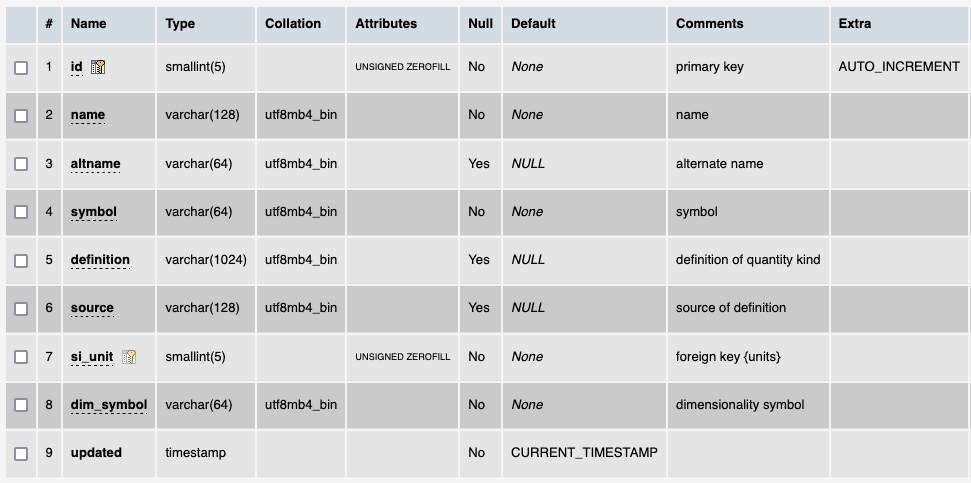

# Table: quantitykinds

**Description**: The general quantitykind of quantities reported in the ThermoML files.  Note these are different
from the groupings of properties in the ThermoML schema.  The groups are captured in the [quantities](table_quantities.md) table.

### MySQL 'quanititykinds' table structure

### MySQL Fields
* **id**: quantity primary key (auto-generated and unique)
* **name**: the quantitykind name
* **altname**: the alternate name of the quantitykind
* **symbol**: the quantitykind symbol
* **definition**: definition of the quantitykind
* **source**: the source of the definition of the quantitykind
* **si_unit**: foreign key ([units table](table_units.md)) of a standard unit for the quantitykind
* **dimsymbol**: dimension symbol for the quantitykind
* **updated**: datetime last updated