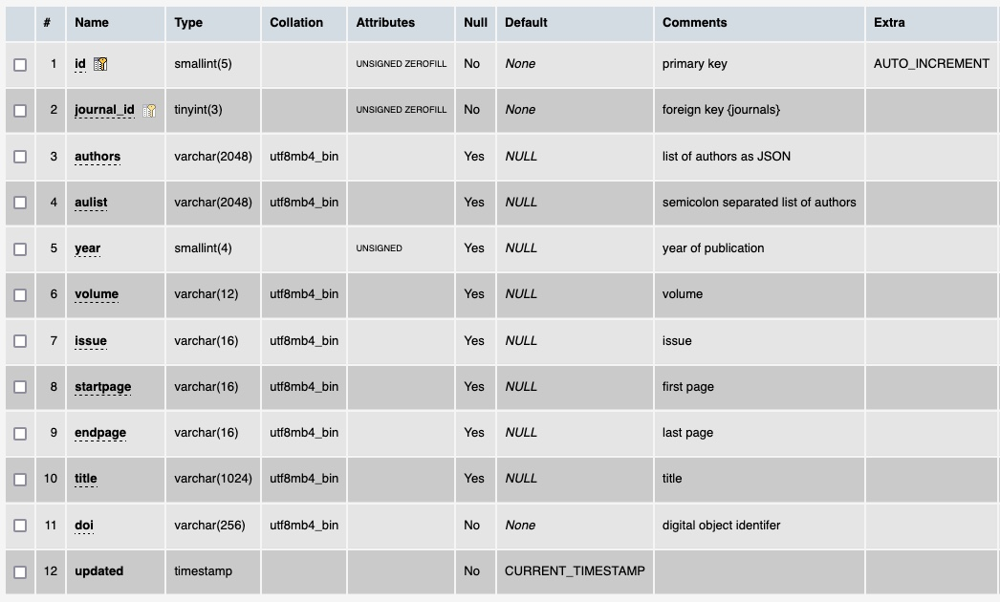

# Table: ?

**Description**: Metadata about the research paper that was published and is associated with a ThermoML file.

### 'Citation' section in the ThermoML Schema

### Example data of a 'Citation' section of a ThermoML file

### MySQL 'references' table structure

### MySQL Fields
* **id**: components primary key (auto-generated and unique)
* **journal_id**: foreign key ([journals table](table_journals.md)) of the journal the paper is published in
* **authors**: JSON encoded list of authors
* **aulist**: a semicolon separated list of authors
* **year**: the publication year
* **volume**: the publication volume
* **issue**:  the publication issue
* **startpage**: the first page of the paper
* **endpage**: the last page of the paper
* **title**: the paper title
* **doi**: the Document Object Identifier (DOI) of the paper
* **updated**: datetime last updated

### Comments
The number of references (11,825) is the same as the number of reports and files.