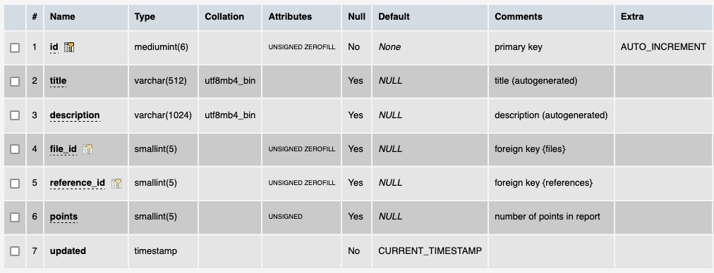

# Table: reports

**Description**: A table representing the report of data presented in a ThermoML file. It correlates with a dataset

### MySQL 'reports' table structure

### MySQL Fields
* **id**: components primary key (auto-generated and unique)
* **title**: the report title (autogenerated)
* **description**: a description of the report (autogenerated)
* **file_id**: foreign key ([files table](table_files.md)) of the file this report is about
* **reference_id**: foreign key ([references table](table_references.md)) of the `reference` the report is about
* **points**: the total number of points in the file that the report is about
* **updated**: datetime last updated

### Comments
The number of reports (11,825) is the same as the number of files and references.