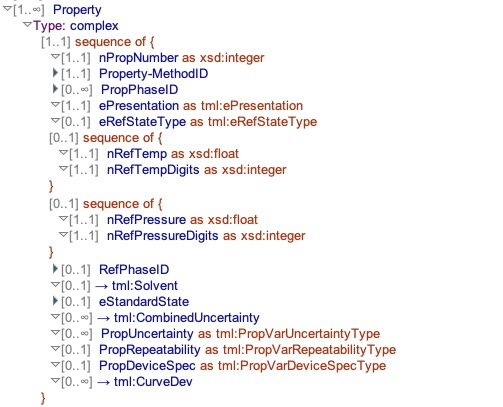
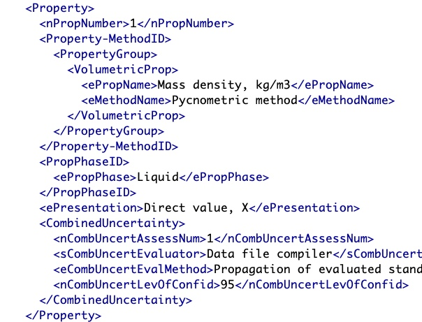
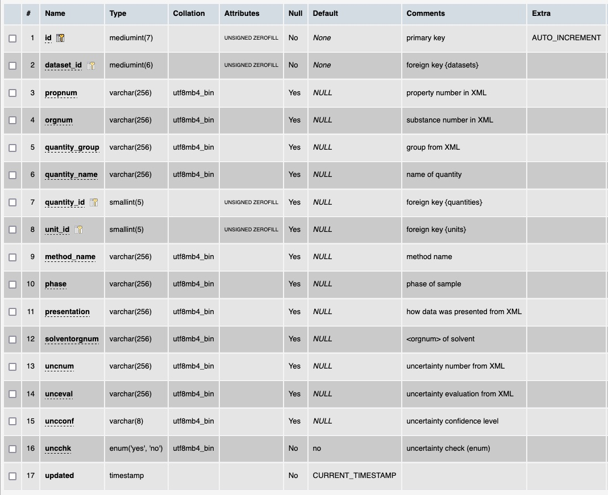

# Table: sampleprops

**Description**: This table captures the instances of the quantities that were measured (of the sample) in the experiment.

### 'Property' section in the ThermoML Schema

### Example data of a 'Property' in the 'PureOrMixtureData' section of a ThermoML file

### MySQL 'sampleprops' table structure

### MySQL Fields
* **id**: components primary key (auto-generated and unique)
* **dataset_id**: foreign key ([datasets table](table_datasets.md)) of the dataset the sampleprop is part of
* **propnum**: the value of the `nPropNumber` field in a ThermoML file
* **orgnum**: the id of the substance in a ThermoML file
* **quantity_group**: the group the quantity is part of as reported in a ThermoML file
* **quantity_name**: the name (with unit) of the quantity measured reported in a ThermoML file
* **quantity_id**: foreign key ([quantities table](table_quantities.md)) of the `quantity` measured
* **unit_id**: foreign key ([units table](table_units.md)) of the `unit` indicated in the ThermoML quantity name
* **method_name**: 
* **uncnum**: the `<nCombUncertAssessNum>` field from a ThermoML file
* **unceval**: the `<nCombUncertEvalMethod>` field from a ThermoML file
* **uncconf**: the `<nCombUncertLevOfConf>` field from a ThermoML file
* **uncchk**: a temporary field used to validate the data in the last three fields is correct.
* **updated**: datetime last updated

### Comments