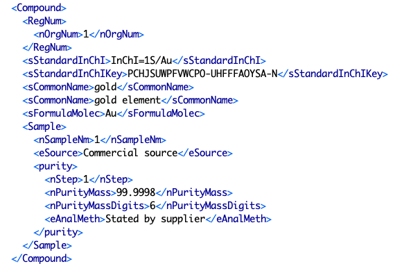

# Table: substances

**Description**: Table of metadata about the (chemical) substances under study.  This table contains only the
general descriptive metadata about a substance that is found in the `<Compound>` section
of a ThermoML file (see below).  Data about the sample of chemical substance is found in the samples table.

Additionally, chemical identifiers for substances are stored in a separate, identifiers table which is more efficient for
storing data as adding fields for each different descriptor type often leads to a significant overhead of empty fields.

### 'Compound' section in the ThermoML Schema

### Example data of a 'Compound' section of a ThermoML file

### MySQL '?' table structure

### MySQL Fields
* **id**: substances primary key (auto-generated and unique)
* **name**: the name of the chemical substance (not necessarily the IUPAC name)
* **type**: classification of the substance at the broadest level (from [ClassyFire](http://classyfire.wishartlab.com/))
* **subtype**: subclassification of the chemical substance (from [ClassyFire](http://classyfire.wishartlab.com/))
* **formula**: the molecular formula of the chemical substance
* **mw**: the molecular weight of the chemical substance
* **mwsrc**: the source of the molecular weight data
* **inchikey**: the IUPAC [InChIKey](https://www.inchi-trust.org) of the chemical substance
* **files**: the number of ThermoML files that references this substance
* **systems**: the number of systems this substance is part of in this dataset
* **updated**: datetime last updated