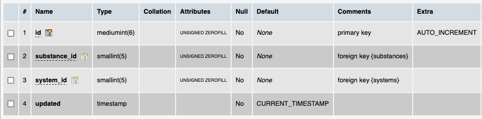

# Table: substances_systems

**Description**:  A join table to link chemical substances and the chemical systems they are part of.

### MySQL 'substances_systems' table structure

### MySQL Fields
* **id**: chemicals_datasets primary key (auto-generated and unique)
* **substance_id**: foreign key ([substances table](table_substances.md)) linking a substance to a chemical system its part of
* **system_id**: foreign key ([systems table](table_systems.md)) linking a system to one of its substances
* **updated**: datetime last updated

### Comments
A join table is needed where there is a many-to-many relationship between data in both tables.  In this case, each
chemical substance can be part of many chemical systems and each chemical system can have many chemical substances.