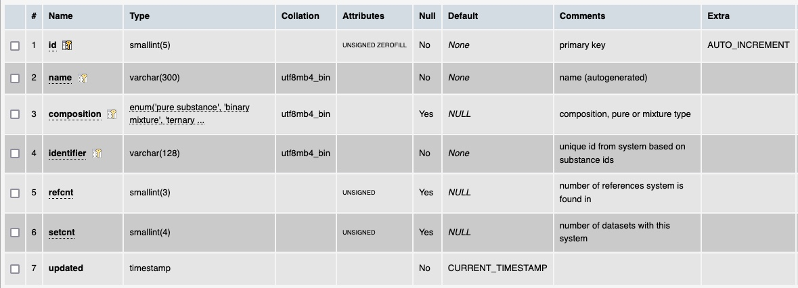

# Table: systems

**Description**: A chemical system is an abstract representation of a pure substance or a mixture, being made
of one or more chemical substances.

### 'Components' section in the ThermoML Schema

### Example data of a set of 'Components' in the 'PureOrMixtureData' section of a ThermoML file

### MySQL 'substances' table structure

### MySQL Fields
* **id**: substances primary key (auto-generated and unique)
* **name**: the name of the chemical system (autogenerated)
* **composition**: the composition of the system, either pur or a mixture of some type.
* **identifier**: a unique identifier for the system based on concatenation of the chemical substance ids with colons
and ordered from lowest to highest
* **refcnt**: the number of references this system is reported in 
* **setcnt**: the number of datasets this system is part of
* **updated**: datetime last updated