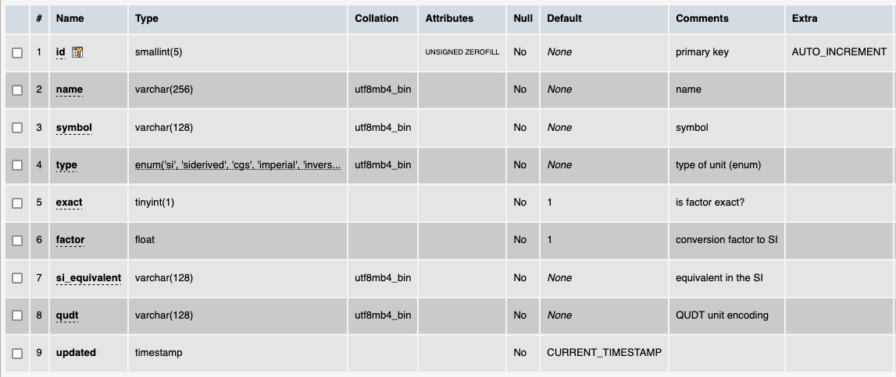

# Table: units

**Description**: Units of measurement used in representing the data in the ThermoML files.

### MySQL 'units' table structure

### MySQL Fields
* **id**: units primary key (auto-generated and unique)
* **name**: the unit name
* **symbol**: the unit symbol
* **type**: the system of units the unit belongs too
* **exact**: is the conversion factor in the `factor` field, exact or not
* **factor**: numeric value of the conversion factor used to convert to the SI equivalent unit
* **si_equivalent**: the SI equivalent of the unit 
* **qudt**: the [QUDT](https://www.qudt.org/) encoding string for the unit
* **updated**: datetime last updated